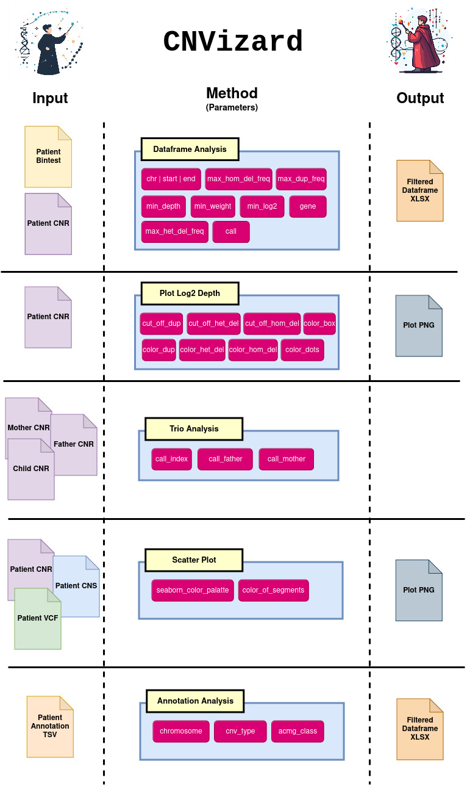

# CNVizard


[](https://opensource.org/licenses/MIT)
[](https://streamlit.io/)
[](https://www.python.org/)

CNVizard is a powerful, Streamlit-based application designed for the visualization and analysis of germline copy number variants (CNVs). This tool provides a streamlined interface for researchers and clinicians to analyze genetic data, create and manage references, and visualize CNV datasets.

## Table of Contents
- [Features](#features)
- [Installation](#installation)
  - [Install via PyPI](#install-via-pypi)
  - [Install via Docker](#install-via-docker)
  - [Install from Source](#install-from-source)
  - [Optional OMIM Annotations](#optional-omim-annotations)
- [Usage](#usage)
  - [Running the Application](#running-the-application)
  - [Creating References](#creating-references)
  - [Visualizing Data](#visualizing-data)
- [License](#license)

## Features
- Visualizes and analyzes germline copy number variants (CNVs)
- Integration with CNVkit-generated `.cnr` and `.bintest` files
- Supports trio analysis and scatter plots
- Generates customizable references
- OMIM-based CNV annotations
- Exportable filtered datasets and visualizations

## Installation

### Install via PyPI

CNVizard can be easily installed from [PyPI](https://pypi.org/project/CNVizard/):

1. **Create and activate a virtual environment:**
   ```bash
   python3 -m venv venv
   source venv/bin/activate
   ```

2. **Install CNVizard:**
   ```bash
   pip install CNVizard
   ```

3. **Run the application:**
   ```bash
   python -m cnvizard.run <ENV>
   ```

### Install via Docker

You can quickly run CNVizard using Docker without setting up a Python environment:

1. **Pull the Docker image:**
   ```bash
   docker pull ghcr.io/ihggm-aachen/cnvizard
   ```

2. **Run the Docker container:**
   ```bash
   docker run -p 8501:8501 cnvizard
   ```

3. **Access the Streamlit app:**
   Open your browser and navigate to `http://localhost:8501` to start using CNVizard.

### Install from Source

To install CNVizard from source, follow these steps:

1. **Clone the repository:**
   ```bash
   git clone https://github.com/IHGGM-Aachen/CNVizard
   cd CNVizard
   ```

2. **Create and activate a virtual environment:**
   ```bash
   python3 -m venv venv
   source venv/bin/activate
   ```

3. **Install the dependencies:**
   ```bash
   pip install -e .
   ```

4. **Ensure you have Tabix installed** (required for processing CNVkit `.vcf.gz` files).

5. **Run the application:**
   ```bash
   streamlit run cnvizard/app.py <ENV>
   ```

## Dependencies and Compatibility

### Dependencies:
- **Tabix**: CNVizard requires **Tabix** for processing `.vcf.gz` files. Tabix can be installed directly over some package management systems or by downloading directly from [Samtools](http://www.htslib.org/download/).

### Pitfalls:
- **Browser Compatibility**: CNVizard works well on most browsers, but some users have reported issues when using **Safari**. We recommend using **Firefox** for the best experience.

## Usage

### Running the Application

1. **Start the application:**
   - If using the Docker container, it will be accessible at `http://localhost:8501`.
   - If installed from PyPI, run:
     ```bash
     python -m cnvizard.run <ENV>
     ```
   - Or if installed from source, run:
     ```bash
     streamlit run cnvizard/app.py <ENV>
     ```

2. **Set up the environment:**
   - **Optional**: Provide an environment file (`.env`) during startup or upload one through the app interface. This file can contain paths to OMIM annotations, candidate lists, and references.
   - If no `.env` file is specified, the app will prompt you to upload or create one.

3. **Upload data files:**
   - Upload `.cnr`, `.bintest`, or `.vcf.gz` files generated by CNVkit.

### Creating References

1. **Reference Creation:**
   CNVizard allows you to create reference files from `.cnr` data. You can specify the type of reference (normal or bintest) and provide paths for input and output data.

2. **Merging References:**
   If you have previously created individual reference files, you can merge them into a consolidated reference.

3. **Convert Genomics England Panel:**
   CNVizard provides a tool to convert Genomics England panel files into a compatible format.

### Visualizing Data

1. **CNV Analysis:**
   - Upload `.cnr` and `.bintest` files for sample analysis.
   - Apply filters for chromosomes, depth, log2 ratio, or specific genes.

2. **Trio Analysis:**
   - You can perform trio analysis by uploading `.cnr` files from parents.

3. **Scatter Plots:**
   - CNVizard supports genome-wide and chromosome-wide scatter plots.
   - Combine `.cnr`, `.cns`, and `.vcf.gz` files to visualize data points across the genome.

4. **Export Results:**
   - Filtered dataframes and visualizations can be exported as Excel files for further analysis.

### Visual Manual



### Optional OMIM Annotations

CNVizard allows you to annotate CNVs with information from OMIM (Online Mendelian Inheritance in Man). OMIM is a copyrighted resource, so we cannot provide these files.

If you wish to use OMIM annotations:
- Obtain a license from [OMIM](https://www.omim.org/help/copyright).
- Download the `mimTitles` files, the `genemap2` file, and the `mim2gene` file.
- Using these three files, create an `omim.txt` file via the web interface of CNVizard.
- Add the path to the `omim.txt` file to the `.env` file.

### Check for dbVar Study Overlap

CNVizard can calculate the overlap of CNVs analyzed in CNVizard with study VCFs obtained from dbVar.

To do this:
- Obtain a study VCF from dbVar (e.g., [dbVar FTP](https://ftp.ncbi.nlm.nih.gov/pub/dbVar/data/Homo_sapiens/by_study/vcf/)).
- Upload it into CNVizard (via the sidebar) in addition to a CNV file annotated with AnnotSV.

## License

This project is licensed under the MIT License. See the [LICENSE](LICENSE) file for more information.